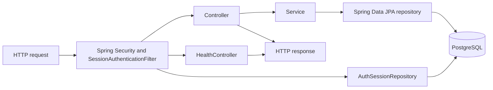
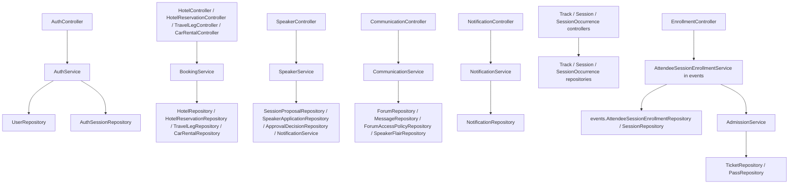
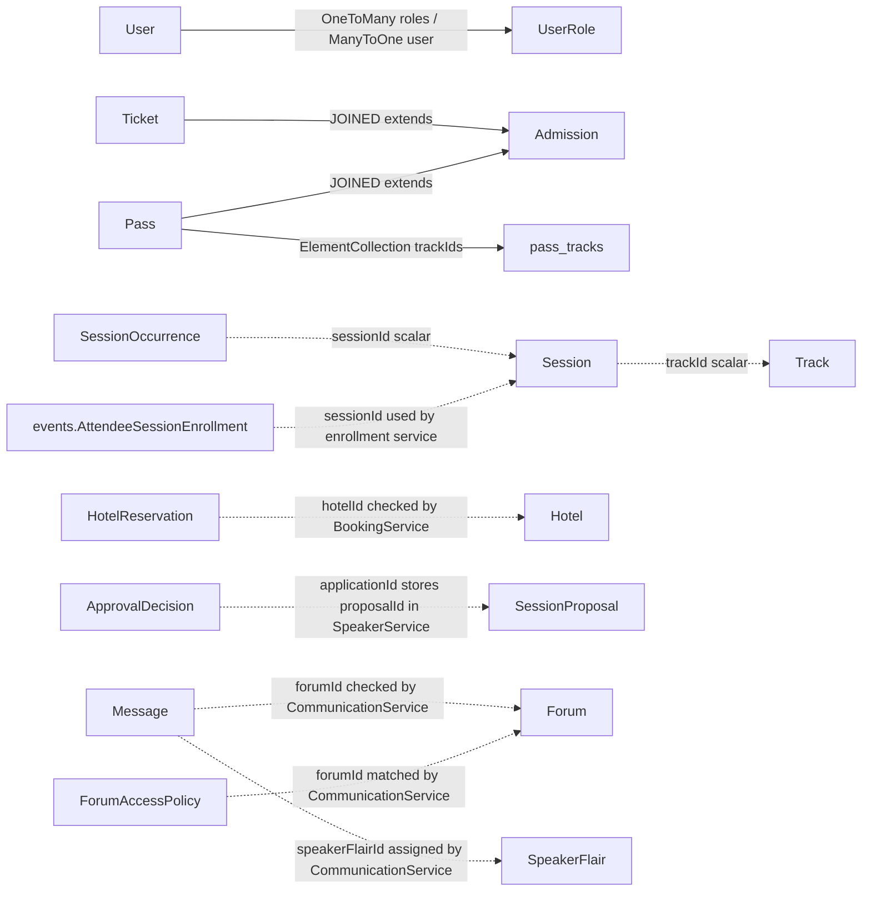
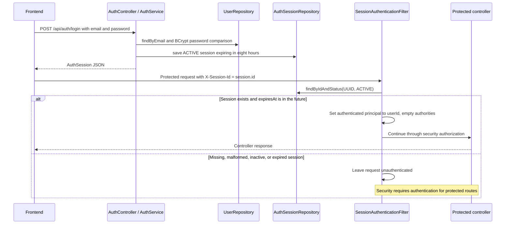

# Backend structure and frontend integration

Source inspection on branch `frontend-speaker-screen`, 2026-09-16. Updated to include the current frontend API adapters, development proxy and permanent frontend tests. Backend code is unchanged.

This reference describes the current post-merge source, not a verified running API. CommunicationService now uses ForumScope.CONCIERGE. Maven compilation has not been tested in this audit; no compilation-success claim is made.

## 1. Current backend overview

The normal persistence path is:

```text
HTTP request
→ Controller
→ Service
→ Repository
→ PostgreSQL
```

Controllers map URLs and pass request values to services. Services implement checks and state changes. Spring Data JPA repositories read and save entities; Hibernate maps them to the configured PostgreSQL database. Responses return through the controller. Spring Security runs before controllers and checks the database-backed session header on protected requests. The health controller returns a string directly without a service or repository.



Sources: [pom.xml](backend/pom.xml), [ZipConApplication](backend/src/main/java/com/sparkcity/steamcon/ZipConApplication.java), [SecurityConfig](backend/src/main/java/com/sparkcity/steamcon/config/SecurityConfig.java), and the controller/service/repository inventories below.

| Setting | Current source value |
| --- | --- |
| Framework / Java | Spring Boot 3.5.5 / Java 17 |
| Maven coordinates | `com.sparkcity:zipcon-backend:0.0.1-SNAPSHOT` |
| Dependencies | Web, Data JPA, Security, Validation, PostgreSQL runtime, Spring Boot Test |
| Application name | `zipcon-backend` |
| Database URL | `DB_URL`, default `jdbc:postgresql://localhost:5432/zipcon` |
| Database credentials | `DB_USERNAME` and `DB_PASSWORD`, both default to `postgres` |
| Schema handling | `spring.jpa.hibernate.ddl-auto=update` |
| Open session in view | `spring.jpa.open-in-view=false` |
| HTTP port / CORS | No port override in `application.properties`; no explicit CORS configuration in inspected Java security/controllers |

Configuration source: [application.properties](backend/src/main/resources/application.properties). This table describes that file; it does not establish runtime environment overrides.

## 2. Modules and dependencies



EnrollmentController now delegates to the events enrollment service. TrackController, SessionController and SessionOccurrenceController map response records directly from repositories. Admission, calendar, itinerary, user roles and the separate `enrollment` package still have no corresponding HTTP controllers. Diagram edges are constructor dependencies, not additional endpoints.

| Service | Existing behavior | Source |
| --- | --- | --- |
| `admission.AdmissionService` | Allow access for an ACTIVE track ticket or the single ACTIVE pass returned by the repository if it contains the track. | [AdmissionService](backend/src/main/java/com/sparkcity/steamcon/admission/AdmissionService.java) |
| `auth.AuthService` | Register a user with BCrypt password hashing; reject duplicate email; login verifies password and saves an eight-hour ACTIVE session. Registration does not assign roles. | [AuthService](backend/src/main/java/com/sparkcity/steamcon/auth/AuthService.java) |
| `booking.BookingService` | Save travel legs and car rentals after requiring userId; list hotels; save hotel reservations after requiring userId and finding hotelId. No provider calls or confirmation generation. | [BookingService](backend/src/main/java/com/sparkcity/steamcon/booking/BookingService.java) |
| `communication.CommunicationService` | List/filter forums; find forum; check supplied role/permission against policies; filter ACTIVE messages; require nonblank body and attach first matching speaker flair. CONCIERGE permits authenticated callers with supplied non-null role/permission; other scopes require a matching policy. ID comparisons use Objects.equals. | [CommunicationService](backend/src/main/java/com/sparkcity/steamcon/communication/CommunicationService.java) |
| `communication.NotificationService` | Create a notification with user/message checks; list by user newest first; mark a notification read. Creation has no controller route; SpeakerService creates notifications after proposal decisions and application-status changes. | [NotificationService](backend/src/main/java/com/sparkcity/steamcon/communication/NotificationService.java) |
| `events.AttendeeSessionEnrollmentService` | Require attendee/session, find session, check admission, reject existing ENROLLED entry, save enrollment; cancel active entry; mandatory auto-enrollment also saves ENROLLED. | [AttendeeSessionEnrollmentService](backend/src/main/java/com/sparkcity/steamcon/events/AttendeeSessionEnrollmentService.java) |
| `speaker.SpeakerService` | Save SUBMITTED proposals and applications; approve/reject a proposal and save an ApprovalDecision whose applicationId stores the proposal ID. Validates submission fields, rejects duplicate speaker/session applications, and sends notifications for decisions and application-status changes. No Session creation. | [SpeakerService](backend/src/main/java/com/sparkcity/steamcon/speaker/SpeakerService.java) |

## 3. HTTP routes defined in controllers

All routes except health, login, and register require authentication in `SecurityConfig`. Statuses below are explicit/default successful controller responses, not promises about error handling or runtime availability. GlobalExceptionHandler maps IllegalArgumentException to HTTP 400 with { timestamp, status, error, message }. BackendCExceptionHandler provides the same shape for speaker/communication packages. These handlers do not cover every failure: @Valid failures use Spring handling, and event detail/update/delete routes explicitly return empty 404 responses for missing IDs.

| Method | Path | Input | Success body / status | Controller |
| --- | --- | --- | --- | --- |
| GET | `/api/health` | None | String `ZipCon backend is running` / 200 | [HealthController](backend/src/main/java/com/sparkcity/steamcon/common/HealthController.java) |
| POST | `/api/auth/login` | LoginRequest | AuthSession / 200 | [AuthController](backend/src/main/java/com/sparkcity/steamcon/auth/AuthController.java) |
| POST | `/api/auth/register` | RegisterRequest | UserResponse / 200 | AuthController |
| GET | `/api/hotels` | None | Hotel[] / 200 | [HotelController](backend/src/main/java/com/sparkcity/steamcon/booking/HotelController.java) |
| POST | `/api/hotel-reservations` | CreateHotelReservationRequest | HotelReservation / 201 | [HotelReservationController](backend/src/main/java/com/sparkcity/steamcon/booking/HotelReservationController.java) |
| POST | `/api/travel-legs` | CreateTravelLegRequest | TravelLeg / 201 | [TravelLegController](backend/src/main/java/com/sparkcity/steamcon/booking/TravelLegController.java) |
| POST | `/api/car-rentals` | CreateCarRentalRequest | CarRental / 201 | [CarRentalController](backend/src/main/java/com/sparkcity/steamcon/booking/CarRentalController.java) |
| POST | `/api/proposals` | CreateProposalRequest | SessionProposal / 201 | [SpeakerController](backend/src/main/java/com/sparkcity/steamcon/speaker/SpeakerController.java) |
| POST | `/api/speaker-applications` | CreateSpeakerApplicationRequest | SpeakerApplication / 201 | SpeakerController |
| POST | `/api/proposals/{id}/decision` | UUID path id, ProposalDecisionRequest | ApprovalDecision / 200 | SpeakerController |
| GET | `/api/forums` | Optional query `scope: ForumScope` | Forum[] / 200 | [CommunicationController](backend/src/main/java/com/sparkcity/steamcon/communication/CommunicationController.java) |
| GET | `/api/forums/{id}/messages` | UUID path id; required query `role: Role`, `permission: ForumPermission` | Message[] / 200 | CommunicationController |
| POST | `/api/forums/{id}/messages` | UUID path id, CreateMessageRequest | Message / 201 | CommunicationController |
| GET | `/api/notifications/me` | Required query `userId: UUID` | Notification[] / 200 | [NotificationController](backend/src/main/java/com/sparkcity/steamcon/communication/NotificationController.java) |
| POST | `/api/notifications/{id}/read` | UUID path id; no body | Notification / 200 | NotificationController |

### Post-merge event and speaker contracts

Sources: [TrackController](backend/src/main/java/com/sparkcity/steamcon/events/TrackController.java), [SessionController](backend/src/main/java/com/sparkcity/steamcon/events/SessionController.java), [SessionOccurrenceController](backend/src/main/java/com/sparkcity/steamcon/events/SessionOccurrenceController.java), [EnrollmentController](backend/src/main/java/com/sparkcity/steamcon/events/EnrollmentController.java), and [SpeakerController](backend/src/main/java/com/sparkcity/steamcon/speaker/SpeakerController.java).

Every route below requires authentication under current SecurityConfig. “Shared browsing” describes frontend ownership, not anonymous access. Admin ownership does not imply server role enforcement: SecurityConfig requires authentication without admin authorities. No optional query filters exist on event list routes. Event detail/update/delete return empty 404 for missing records.

| Method | Exact path | Input | Success response / status | Authentication | Intended frontend owner |
| --- | --- | --- | --- | --- | --- |
| GET | `/api/tracks` | None | TrackResponse[] / 200 | Required | Shared frontend browsing; Frontend B/shared proposal track selection |
| GET | `/api/tracks/{id}` | UUID path id | TrackResponse / 200 | Required | Shared frontend browsing; Frontend B/shared proposal track selection |
| POST | `/api/tracks` | CreateTrackRequest JSON body | TrackResponse / 201 | Required | Admin/unassigned |
| PUT | `/api/tracks/{id}` | UUID path id; CreateTrackRequest JSON body | TrackResponse / 200 | Required | Admin/unassigned |
| DELETE | `/api/tracks/{id}` | UUID path id | No body (Void) / 204 | Required | Admin/unassigned |
| GET | `/api/sessions` | None | SessionResponse[] / 200 | Required | Shared frontend browsing |
| GET | `/api/sessions/{id}` | UUID path id | SessionResponse / 200 | Required | Shared frontend browsing |
| POST | `/api/sessions` | CreateSessionRequest JSON body | SessionResponse / 201 | Required | Admin/unassigned |
| PUT | `/api/sessions/{id}` | UUID path id; CreateSessionRequest JSON body | SessionResponse / 200 | Required | Admin/unassigned |
| DELETE | `/api/sessions/{id}` | UUID path id | No body (Void) / 204 | Required | Admin/unassigned |
| GET | `/api/session-occurrences` | None | SessionOccurrenceResponse[] / 200 | Required | Shared frontend browsing |
| GET | `/api/session-occurrences/{id}` | UUID path id | SessionOccurrenceResponse / 200 | Required | Shared frontend browsing |
| POST | `/api/session-occurrences` | CreateSessionOccurrenceRequest JSON body | SessionOccurrenceResponse / 201 | Required | Admin/unassigned |
| PUT | `/api/session-occurrences/{id}` | UUID path id; CreateSessionOccurrenceRequest JSON body | SessionOccurrenceResponse / 200 | Required | Admin/unassigned |
| DELETE | `/api/session-occurrences/{id}` | UUID path id | No body (Void) / 204 | Required | Admin/unassigned |
| POST | `/api/enrollments` | CreateEnrollmentRequest JSON body | EnrollmentResponse / 201 | Required | Frontend A |
| DELETE | `/api/enrollments` | Required UUID query attendeeId, sessionId; no body | No body (Void) / 204 | Required | Frontend A |
| POST | `/api/proposals` | CreateProposalRequest JSON body | SessionProposal / 201 | Required | Frontend B |
| POST | `/api/speaker-applications` | CreateSpeakerApplicationRequest JSON body | SpeakerApplication / 201 | Required | Frontend B |
| POST | `/api/proposals/{id}/decision` | UUID path id; ProposalDecisionRequest JSON body | ApprovalDecision / 200 | Required | Admin/unassigned |
| POST | `/api/speaker-applications/{id}/status` | UUID path id; SpeakerApplicationStatusRequest JSON body | SpeakerApplication / 200 | Required | Admin/unassigned |

Event records (UUIDs serialize as strings, Instants as timestamps):

| Record | Exact components | Validation on request |
| --- | --- | --- |
| CreateTrackRequest | name, description | Nonblank name, max 100; description max 500 |
| TrackResponse | id, name, description | Response |
| CreateSessionRequest | title, description, trackId, mandatory | Nonblank title max 100; description max 500; non-null trackId; mandatory is boolean |
| SessionResponse | id, title, description, trackId, mandatory | Response |
| CreateSessionOccurrenceRequest | sessionId, startsAt, endsAt | All non-null; endsAt must be after startsAt |
| SessionOccurrenceResponse | id, sessionId, startsAt, endsAt | Response |
| CreateEnrollmentRequest | attendeeId, sessionId | Both non-null |
| EnrollmentResponse | id, attendeeId, sessionId, status, enrolledAt | Response; status uses events.EnrollmentStatus |
| SpeakerApplicationStatusRequest | status | ApplicationStatus: SUBMITTED, APPROVED, REJECTED; service rejects null |

Existing speaker request records are unchanged: CreateProposalRequest { speakerId, title, description, trackId }; CreateSpeakerApplicationRequest { speakerId, sessionId }; ProposalDecisionRequest { adminReviewerId, decision, comment }. Application-status updates and proposal decisions now trigger notifications. Proposal GET/update/dashboard routes remain absent.

### Request and response records

Body records use their exact component names. UUIDs are JSON strings; Instant values should be ISO-8601 timestamps with an offset, such as `2026-10-10T10:00:00Z`. Enums use the identifiers listed below. Event create/update and enrollment POST bodies use @Valid. Existing auth, speaker, booking and communication bodies do not use @Valid. Event request constraints are documented below.

| Record | Components in source | Source |
| --- | --- | --- |
| `LoginRequest` | `String email, String password` | [AuthController](backend/src/main/java/com/sparkcity/steamcon/auth/AuthController.java) |
| `RegisterRequest` | `String email, String displayName, String password` | [AuthController](backend/src/main/java/com/sparkcity/steamcon/auth/AuthController.java) |
| `UserResponse` | `UUID id, String email, String displayName` | [UserResponse](backend/src/main/java/com/sparkcity/steamcon/auth/UserResponse.java) |
| `CreateCarRentalRequest` | `UUID userId, Instant pickupAt, Instant dropoffAt, String pickupLocation, String dropoffLocation` | [CreateCarRentalRequest](backend/src/main/java/com/sparkcity/steamcon/booking/CreateCarRentalRequest.java) |
| `CreateHotelReservationRequest` | `UUID userId, UUID hotelId, Instant checkIn, Instant checkOut` | [CreateHotelReservationRequest](backend/src/main/java/com/sparkcity/steamcon/booking/CreateHotelReservationRequest.java) |
| `CreateTravelLegRequest` | `UUID userId, String origin, String destination, Instant departureAt, Instant arrivalAt` | [CreateTravelLegRequest](backend/src/main/java/com/sparkcity/steamcon/booking/CreateTravelLegRequest.java) |
| `CreateMessageRequest` | `UUID authorId, String body, Role role, ForumPermission permission` | [CreateMessageRequest](backend/src/main/java/com/sparkcity/steamcon/communication/CreateMessageRequest.java) |
| `CreateProposalRequest` | `UUID speakerId, String title, String description, UUID trackId` | [CreateProposalRequest](backend/src/main/java/com/sparkcity/steamcon/speaker/CreateProposalRequest.java) |
| `CreateSpeakerApplicationRequest` | `UUID speakerId, UUID sessionId` | [CreateSpeakerApplicationRequest](backend/src/main/java/com/sparkcity/steamcon/speaker/CreateSpeakerApplicationRequest.java) |
| `ProposalDecisionRequest` | `UUID adminReviewerId, ApprovalDecisionType decision, String comment` | [ProposalDecisionRequest](backend/src/main/java/com/sparkcity/steamcon/speaker/ProposalDecisionRequest.java) |

Most successful bodies are entities, not dedicated response DTOs. The entity inventory lists persisted Java fields; getter visibility determines default JSON properties. In particular, `SessionProposal.submittedAt`, `SpeakerApplication.submittedAt`, and `ApprovalDecision.decidedAt` have no getters and should not be assumed present in responses. `HotelReservation` accepts request `checkIn` but exposes response `checkin` via `getCheckin()`. `Notification` persists `readFlag` but exposes JSON `read` via `isRead()`. AuthSession exposes `id`, `userId`, `createdAt`, `expiresAt`, and `status`. UserResponse exposes only `id`, `email`, and `displayName`.

## 4. Entities and stored relationships

All entity IDs are UUIDs generated with `GenerationType.UUID`; subclasses Ticket/Pass inherit Admission's ID. Table names below are explicit `@Table` values. Other column naming depends on Hibernate naming behavior; these are Java fields rather than a claimed live database schema.

| Package / entity | Table | Declared fields (inherited Admission fields listed separately) | Source |
| --- | --- | --- | --- |
| `admission.Admission` | `admissions` | `UUID id`, `UUID userId`, `AdmissionStatus status`, `Instant issuedAt` | [Admission](backend/src/main/java/com/sparkcity/steamcon/admission/Admission.java) |
| `admission.Pass` | `passes` | `String passType`, `Set<UUID> trackIds` | [Pass](backend/src/main/java/com/sparkcity/steamcon/admission/Pass.java) |
| `admission.Ticket` | `tickets` | `UUID trackId` | [Ticket](backend/src/main/java/com/sparkcity/steamcon/admission/Ticket.java) |
| `booking.CarRental` | `car_rentals` | `UUID id`, `UUID userId`, `String pickupLocation`, `String dropoffLocation`, `Instant pickupAt`, `Instant dropoffAt`, `BookingStatus status` | [CarRental](backend/src/main/java/com/sparkcity/steamcon/booking/CarRental.java) |
| `booking.Hotel` | `hotels` | `UUID id`, `String name`, `String address` | [Hotel](backend/src/main/java/com/sparkcity/steamcon/booking/Hotel.java) |
| `booking.HotelReservation` | `hotel_reservations` | `UUID id`, `UUID userId`, `UUID hotelId`, `Instant checkin`, `Instant checkOut`, `String confirmationCode`, `BookingStatus status` | [HotelReservation](backend/src/main/java/com/sparkcity/steamcon/booking/HotelReservation.java) |
| `booking.TravelLeg` | `travel_legs` | `UUID id`, `UUID userId`, `String origin`, `String destination`, `Instant departureAt`, `Instant arrivalAt`, `BookingStatus status` | [TravelLeg](backend/src/main/java/com/sparkcity/steamcon/booking/TravelLeg.java) |
| `calendar.Calendar` | `calendars` | `UUID id`, `UUID userId`, `String timezone` | [Calendar](backend/src/main/java/com/sparkcity/steamcon/calendar/Calendar.java) |
| `calendar.ItineraryEntry` | `itinerary_entries` | `UUID id`, `UUID calendarId`, `Instant startsAt`, `Instant endsAt`, `ItineraryEntryType entryType`, `UUID sourceId` | [ItineraryEntry](backend/src/main/java/com/sparkcity/steamcon/calendar/ItineraryEntry.java) |
| `communication.Forum` | `forums` | `UUID id`, `String name`, `UUID trackId`, `ForumScope scope` | [Forum](backend/src/main/java/com/sparkcity/steamcon/communication/Forum.java) |
| `communication.ForumAccessPolicy` | `forum_access_policies` | `UUID id`, `UUID forumId`, `Role role`, `ForumPermission permission` | [ForumAccessPolicy](backend/src/main/java/com/sparkcity/steamcon/communication/ForumAccessPolicy.java) |
| `communication.Message` | `messages` | `UUID id`, `String body`, `Instant postedAt`, `MessageStatus status`, `UUID authorId`, `UUID forumId`, `UUID speakerFlairId` | [Message](backend/src/main/java/com/sparkcity/steamcon/communication/Message.java) |
| `communication.Notification` | `notifications` | `UUID id`, `UUID userId`, `String message`, `NotificationType type`, `boolean readFlag`, `Instant createdAt` | [Notification](backend/src/main/java/com/sparkcity/steamcon/communication/Notification.java) |
| `communication.SpeakerFlair` | `speaker_flair` | `UUID id`, `UUID userId`, `String label`, `String displayStyle` | [SpeakerFlair](backend/src/main/java/com/sparkcity/steamcon/communication/SpeakerFlair.java) |
| `enrollment.AttendeeSessionEnrollment` | `attendee_session_enrollments` | `UUID id`, `UUID userId`, `UUID occurrenceId`, `UUID admissionId`, `UUID calendarId`, `Instant enrolledAt`, `EnrollmentStatus status` | [AttendeeSessionEnrollment](backend/src/main/java/com/sparkcity/steamcon/enrollment/AttendeeSessionEnrollment.java) |
| `events.AttendeeSessionEnrollment` | `attendee_session_enrollments` | `UUID id`, `UUID attendeeId`, `UUID sessionId`, `EnrollmentStatus status`, `Instant enrolledAt` | [AttendeeSessionEnrollment](backend/src/main/java/com/sparkcity/steamcon/events/AttendeeSessionEnrollment.java) |
| `events.Session` | `sessions` | `UUID id`, `String title`, `String description`, `UUID trackId`, `boolean mandatory` | [Session](backend/src/main/java/com/sparkcity/steamcon/events/Session.java) |
| `events.SessionOccurrence` | `session_occurrences` | `UUID id`, `UUID sessionId`, `Instant startsAt`, `Instant endsAt` | [SessionOccurrence](backend/src/main/java/com/sparkcity/steamcon/events/SessionOccurrence.java) |
| `events.Track` | `tracks` | `UUID id`, `String name`, `String description` | [Track](backend/src/main/java/com/sparkcity/steamcon/events/Track.java) |
| `identity.AuthSession` | `auth_sessions` | `UUID id`, `UUID userId`, `Instant createdAt`, `Instant expiresAt`, `AuthSessionStatus status` | [AuthSession](backend/src/main/java/com/sparkcity/steamcon/identity/AuthSession.java) |
| `identity.User` | `users` | `UUID id`, `String email`, `String displayName`, `String passwordHash`, `String organization`, `List<UserRole> roles` | [User](backend/src/main/java/com/sparkcity/steamcon/identity/User.java) |
| `identity.UserRole` | `user_roles` | `UUID id`, `User user`, `Role role`, `Instant assignedAt`, `boolean active` | [UserRole](backend/src/main/java/com/sparkcity/steamcon/identity/UserRole.java) |
| `speaker.ApprovalDecision` | `approval_decisions` | `UUID id`, `UUID applicationId`, `UUID adminReviewerId`, `ApprovalDecisionType decision`, `Instant decidedAt`, `String comment` | [ApprovalDecision](backend/src/main/java/com/sparkcity/steamcon/speaker/ApprovalDecision.java) |
| `speaker.SessionProposal` | `session_proposals` | `UUID id`, `UUID speakerId`, `String title`, `String description`, `UUID trackId`, `Instant submittedAt`, `ProposalStatus status` | [SessionProposal](backend/src/main/java/com/sparkcity/steamcon/speaker/SessionProposal.java) |
| `speaker.SpeakerApplication` | `speaker_applications` | `UUID id`, `UUID speakerId`, `UUID sessionId`, `Instant submittedAt`, `ApplicationStatus status` | [SpeakerApplication](backend/src/main/java/com/sparkcity/steamcon/speaker/SpeakerApplication.java) |

Only User/UserRole declare object associations (`@OneToMany(mappedBy="user")` and `@ManyToOne` with nonnullable `user_id`). Admission uses JOINED inheritance; Pass has an `@ElementCollection` in `pass_tracks`, joined through `pass_id`, storing UUID `track_id` values. Other IDs are scalar UUID fields, not JPA object associations or proof of foreign-key constraints.



Solid edges describe explicit mappings/inheritance. Dotted edges describe scalar IDs and, where labeled, service usage; they assert no database cardinality. Other scalar references are fully listed in the entity table. `ItineraryEntry.sourceId` has no resolver in this code; no automatic calendar population is implemented.

`SessionOccurrence` exposes start/end getters and validates end after start. The separate [DEScheduleDateTimeInput](backend/src/main/java/com/sparkcity/steamcon/events/DEScheduleDateTimeInput.java) interface declares `Instant getStartsAt()` and `Instant getEndsAt()`; no current class implements it. It is not a request/response record or endpoint.

### Repositories

Every repository extends `JpaRepository<Entity, UUID>` and inherits CRUD methods. Listed methods are the only additional declarations. Repository existence alone does not expose an HTTP endpoint.

| Repository | Entity | Additional declarations | Source |
| --- | --- | --- | --- |
| `admission.PassRepository` | `Pass` | `findByUserIdAndStatus(UUID userId, AdmissionStatus status)` | [PassRepository](backend/src/main/java/com/sparkcity/steamcon/admission/PassRepository.java) |
| `admission.TicketRepository` | `Ticket` | `findByUserIdAndTrackIdAndStatus(UUID userId, UUID trackId, AdmissionStatus status)` | [TicketRepository](backend/src/main/java/com/sparkcity/steamcon/admission/TicketRepository.java) |
| `booking.CarRentalRepository` | `CarRental` | None | [CarRentalRepository](backend/src/main/java/com/sparkcity/steamcon/booking/CarRentalRepository.java) |
| `booking.HotelRepository` | `Hotel` | None | [HotelRepository](backend/src/main/java/com/sparkcity/steamcon/booking/HotelRepository.java) |
| `booking.HotelReservationRepository` | `HotelReservation` | None | [HotelReservationRepository](backend/src/main/java/com/sparkcity/steamcon/booking/HotelReservationRepository.java) |
| `booking.TravelLegRepository` | `TravelLeg` | None | [TravelLegRepository](backend/src/main/java/com/sparkcity/steamcon/booking/TravelLegRepository.java) |
| `calendar.CalendarRepository` | `Calendar` | None | [CalendarRepository](backend/src/main/java/com/sparkcity/steamcon/calendar/CalendarRepository.java) |
| `calendar.ItineraryEntryRepository` | `ItineraryEntry` | None | [ItineraryEntryRepository](backend/src/main/java/com/sparkcity/steamcon/calendar/ItineraryEntryRepository.java) |
| `communication.ForumAccessPolicyRepository` | `ForumAccessPolicy` | None | [ForumAccessPolicyRepository](backend/src/main/java/com/sparkcity/steamcon/communication/ForumAccessPolicyRepository.java) |
| `communication.ForumRepository` | `Forum` | None | [ForumRepository](backend/src/main/java/com/sparkcity/steamcon/communication/ForumRepository.java) |
| `communication.MessageRepository` | `Message` | None | [MessageRepository](backend/src/main/java/com/sparkcity/steamcon/communication/MessageRepository.java) |
| `communication.NotificationRepository` | `Notification` | `findByUserIdOrderByCreatedAtDesc(UUID userId)` | [NotificationRepository](backend/src/main/java/com/sparkcity/steamcon/communication/NotificationRepository.java) |
| `communication.SpeakerFlairRepository` | `SpeakerFlair` | None | [SpeakerFlairRepository](backend/src/main/java/com/sparkcity/steamcon/communication/SpeakerFlairRepository.java) |
| `enrollment.AttendeeSessionEnrollmentRepository` | `AttendeeSessionEnrollment` | None | [AttendeeSessionEnrollmentRepository](backend/src/main/java/com/sparkcity/steamcon/enrollment/AttendeeSessionEnrollmentRepository.java) |
| `events.AttendeeSessionEnrollmentRepository` | `AttendeeSessionEnrollment` | `findByAttendeeIdAndSessionIdAndStatus(UUID attendeeId, UUID sessionId, EnrollmentStatus status)` | [AttendeeSessionEnrollmentRepository](backend/src/main/java/com/sparkcity/steamcon/events/AttendeeSessionEnrollmentRepository.java) |
| `events.SessionOccurrenceRepository` | `SessionOccurrence` | None | [SessionOccurrenceRepository](backend/src/main/java/com/sparkcity/steamcon/events/SessionOccurrenceRepository.java) |
| `events.SessionRepository` | `Session` | None | [SessionRepository](backend/src/main/java/com/sparkcity/steamcon/events/SessionRepository.java) |
| `events.TrackRepository` | `Track` | None | [TrackRepository](backend/src/main/java/com/sparkcity/steamcon/events/TrackRepository.java) |
| `identity.AuthSessionRepository` | `AuthSession` | `findByIdAndStatus(UUID id, AuthSessionStatus status)` | [AuthSessionRepository](backend/src/main/java/com/sparkcity/steamcon/identity/AuthSessionRepository.java) |
| `identity.UserRepository` | `User` | `findByEmail(String email)` | [UserRepository](backend/src/main/java/com/sparkcity/steamcon/identity/UserRepository.java) |
| `identity.UserRoleRepository` | `UserRole` | None | [UserRoleRepository](backend/src/main/java/com/sparkcity/steamcon/identity/UserRoleRepository.java) |
| `speaker.ApprovalDecisionRepository` | `ApprovalDecision` | None | [ApprovalDecisionRepository](backend/src/main/java/com/sparkcity/steamcon/speaker/ApprovalDecisionRepository.java) |
| `speaker.SessionProposalRepository` | `SessionProposal` | None | [SessionProposalRepository](backend/src/main/java/com/sparkcity/steamcon/speaker/SessionProposalRepository.java) |
| `speaker.SpeakerApplicationRepository` | `SpeakerApplication` | None | [SpeakerApplicationRepository](backend/src/main/java/com/sparkcity/steamcon/speaker/SpeakerApplicationRepository.java) |

### Enums

| Enum | Defined values | Source |
| --- | --- | --- |
| `admission.AdmissionStatus` | `ACTIVE`, `CANCELLED`, `EXPIRED` | [AdmissionStatus](backend/src/main/java/com/sparkcity/steamcon/admission/AdmissionStatus.java) |
| `booking.BookingStatus` | `PLANNED`, `CONFIRMED`, `CANCELLED`, `COMPLETED` | [BookingStatus](backend/src/main/java/com/sparkcity/steamcon/booking/BookingStatus.java) |
| `calendar.ItineraryEntryType` | `SESSION`, `TRAVEL`, `CAR_RENTAL`, `HOTEL` | [ItineraryEntryType](backend/src/main/java/com/sparkcity/steamcon/calendar/ItineraryEntryType.java) |
| `communication.ForumPermission` | `READ`, `POST`, `MODERATE` | [ForumPermission](backend/src/main/java/com/sparkcity/steamcon/communication/ForumPermission.java) |
| `communication.ForumScope` | `TRACK`, `ADMIN`, `CONCIERGE` | [ForumScope](backend/src/main/java/com/sparkcity/steamcon/communication/ForumScope.java) |
| `communication.MessageStatus` | `ACTIVE`, `HIDDEN`, `DELETED` | [MessageStatus](backend/src/main/java/com/sparkcity/steamcon/communication/MessageStatus.java) |
| `communication.NotificationType` | `PROPOSAL_APPROVED`, `PROPOSAL_REJECTED`, `SPEAKER_APPLICATION_UPDATED`, `GENERAL` | [NotificationType](backend/src/main/java/com/sparkcity/steamcon/communication/NotificationType.java) |
| `enrollment.EnrollmentStatus` | `ENROLLED`, `CANCELLED`, `AUTO_ENROLLED` | [EnrollmentStatus](backend/src/main/java/com/sparkcity/steamcon/enrollment/EnrollmentStatus.java) |
| `events.EnrollmentStatus` | `ENROLLED`, `CANCELLED` | [EnrollmentStatus](backend/src/main/java/com/sparkcity/steamcon/events/EnrollmentStatus.java) |
| `identity.AuthSessionStatus` | `ACTIVE`, `EXPIRED`, `REVOKED` | [AuthSessionStatus](backend/src/main/java/com/sparkcity/steamcon/identity/AuthSessionStatus.java) |
| `identity.Role` | `ATTENDEE`, `SPEAKER`, `ADMIN` | [Role](backend/src/main/java/com/sparkcity/steamcon/identity/Role.java) |
| `speaker.ApplicationStatus` | `SUBMITTED`, `APPROVED`, `REJECTED` | [ApplicationStatus](backend/src/main/java/com/sparkcity/steamcon/speaker/ApplicationStatus.java) |
| `speaker.ApprovalDecisionType` | `APPROVE`, `REJECT` | [ApprovalDecisionType](backend/src/main/java/com/sparkcity/steamcon/speaker/ApprovalDecisionType.java) |
| `speaker.ProposalStatus` | `SUBMITTED`, `APPROVED`, `REJECTED` | [ProposalStatus](backend/src/main/java/com/sparkcity/steamcon/speaker/ProposalStatus.java) |

## 5. Authentication and frontend connection



Sources: [AuthService](backend/src/main/java/com/sparkcity/steamcon/auth/AuthService.java), [SessionAuthenticationFilter](backend/src/main/java/com/sparkcity/steamcon/auth/SessionAuthenticationFilter.java), [SecurityConfig](backend/src/main/java/com/sparkcity/steamcon/config/SecurityConfig.java), [PasswordConfig](backend/src/main/java/com/sparkcity/steamcon/config/PasswordConfig.java).

Use `Content-Type: application/json` for JSON bodies. For protected calls, send the returned session `id` in `X-Session-Id`; `userId` is the principal/identity ID, not the authentication token. The filter does not issue a JWT or a cookie, load user roles, mark expired sessions EXPIRED, or revoke sessions. CSRF is disabled. The configuration defines authentication for all other requests but no role-specific authorization rules.

Controllers accept user/speaker/author/reviewer IDs and forum role/permission values from the caller. They do not derive those values from the authenticated principal or verify ownership. `/api/notifications/me` requires a caller-supplied userId despite its name, and mark-read does not check notification ownership. Proposal decisions do not enforce an ADMIN authority. Frontend role restrictions cannot establish backend authorization.

| Current frontend integration code | What it does | Connection to current backend |
| --- | --- | --- |
| [authService.login](frontend/src/services/authService.js) | Sends POST `/api/auth/login`; validates ACTIVE session with future expiry; stores sessionId and userId in sessionStorage | Matches AuthSession getters; production user has `role: null` because backend supplies no role/display name |
| `authService.headers` / `authenticatedFetch` | Adds X-Session-Id for a valid stored backend session; wrapper rejects another origin | Use this wrapper for protected routes in the route table; API must be reachable through the application origin |
| `authService.restore` | Restores permitted demo accounts; discards cached backend identity | Backend has no current-user endpoint for revalidating identity |
| `authService.logout` | Removes local session storage | No backend logout/revocation route exists; database session remains active until expiry unless changed elsewhere |
| Demo authentication in authService | Returns local demo identity, no backend token | Demo sessions cannot authenticate protected backend requests |
| [speakerRepository](frontend/src/services/speakerRepository.js) | Mock getDashboard/getProposal; in-memory saveDraft; createProposal sends POST `/api/proposals` through authenticatedFetch | Submission sends only speakerId, trimmed title/description and trackId. Backend starts SUBMITTED; no format/duration fields or dashboard, proposal retrieval, or draft-edit route |
| [notificationRepository](frontend/src/services/notificationRepository.js) | GET `/api/notifications/me?userId=…`; POST `/api/notifications/{id}/read` | Uses authenticatedFetch; requires caller-supplied IDs and returns backend JSON |
| [forumRepository](frontend/src/services/forumRepository.js) | GET forums with optional scope; GET messages with role/permission; POST messages | Uses authenticatedFetch; sends authorId, trimmed body, role and permission |
| [eventRepository](frontend/src/services/eventRepository.js) | GET tracks, sessions and session occurrences, both list and detail | Uses authenticatedFetch; returns response records unchanged; no write operations or UI wiring |
| [Vite proxy](frontend/vite.config.js) | Development-only `/api` proxy | Default target http://localhost:8080; VITE_API_PROXY_TARGET override; disabled for build/preview |

The five frontend service/repository files above exist, including eventRepository for authenticated event reads. No registration operation exists in authService itself, though the backend defines registration; no booking adapter is included. Production deployment must provide a same-origin API because the Vite proxy applies only to development.

An endpoint declared in backend source, an available frontend adapter, a connected UI, and a working live feature are separate states. Adapter existence does not prove end-to-end functionality; live backend integration and Maven compilation have not been tested in this audit.

| Feature | Backend endpoint | Frontend adapter | UI/live state |
| --- | --- | --- | --- |
| Login | Exists | Connected | Real login lacks role |
| Notification loading | Exists | Exists | Not active in Bill Nye demo |
| Mark notification read | Exists | Exists | Not active in Bill Nye demo |
| Forum listing | Exists | Exists | No forum UI connection yet |
| Forum messages | Exists | Exists | No forum UI connection yet |
| Send forum message | Exists | Exists | No forum UI connection yet |
| Track/session/occurrence reads | Exists, authentication required | eventRepository exists | No new UI connection |
| Proposal creation | Exists | Exists | Propose button not connected |
| Proposal dashboard loading | Missing | Mock repository only | Mock-backed |
| Proposal editing | Backend missing | In-memory frontend only | Mock-backed |

Protected adapters require a backend-authenticated account and real UUIDs. No fake UUIDs are generated or mock IDs converted. Bill Nye's mock dashboard and draft editing remain intentionally separate from submission.

Do not map mock speaker IDs to backend UUIDs or send demo IDs. Existing API bodies require real UUIDs where declared. Existing speaker read/edit frontend operations cannot be implemented with the current backend route set alone. Track/session/occurrence listing and detail routes and enrollment POST/DELETE now exist. There are still no controller routes for admission purchase, calendar/itinerary retrieval, booking lists, or booking cancellation. eventRepository supplies real track IDs for future speaker proposal selection; the proposal UI remains unconnected.

## 6. Tests and known source limitations

Backend tests below were inspected, not executed; Maven was not run. Frontend permanent tests include `frontend/tests/apiRepositories.test.js` for contracts, validation and response failures, `frontend/tests/viteProxy.test.js` for development targets and production output, and existing auth/speaker/browser tests. Frontend validation does not establish that the backend starts or live routes work.

| Existing test file | Checks present |
| --- | --- |
| [AdmissionServiceTest](backend/src/test/java/com/sparkcity/steamcon/admission/AdmissionServiceTest.java) | Active ticket, pass containing track, denied access without either |
| [BookingServiceTest](backend/src/test/java/com/sparkcity/steamcon/booking/BookingServiceTest.java) | Travel/car saves, missing travel userId, hotel listing, reservation save, missing hotel |
| [SpeakerServiceTest](backend/src/test/java/com/sparkcity/steamcon/speaker/SpeakerServiceTest.java) | Proposal/application saves, approval/rejection status change, missing proposal |
| [CommunicationServiceTest](backend/src/test/java/com/sparkcity/steamcon/communication/CommunicationServiceTest.java) | Forum listing/filtering, message body/visibility, missing forum, policy checks, flair attachment |
| [NotificationServiceTest](backend/src/test/java/com/sparkcity/steamcon/communication/NotificationServiceTest.java) | Creation, blank message rejection, user listing, mark-read, missing notification |
| [AttendeeSessionEnrollmentServiceTest](backend/src/test/java/com/sparkcity/steamcon/events/AttendeeSessionEnrollmentServiceTest.java) | Enrollment with admission, no admission, duplicates, cancellation, null IDs, mandatory auto-enrollment and nonmandatory rejection |
| [AttendeeSessionEnrollmentTest](backend/src/test/java/com/sparkcity/steamcon/events/AttendeeSessionEnrollmentTest.java) | Required attendee/session, default ENROLLED, cancellation |
| [TrackTest](backend/src/test/java/com/sparkcity/steamcon/events/TrackTest.java) | Name required/max 100, description max 500 |
| [SessionTest](backend/src/test/java/com/sparkcity/steamcon/events/SessionTest.java) | Title required/max 100, description max 500, required track |
| [SessionOccurrenceTest](backend/src/test/java/com/sparkcity/steamcon/events/SessionOccurrenceTest.java) | Required session/times, end after start, simultaneous occurrences allowed |
| [ZipConApplicationTests](backend/src/test/java/com/sparkcity/steamcon/ZipConApplicationTests.java) | Constructs application class and asserts nonnull; does not load Spring context |

TrackControllerTest, SessionControllerTest, SessionOccurrenceControllerTest and EnrollmentControllerTest now exercise HTTP contracts through MockMvc with security filters disabled and mocked dependencies. They do not establish authenticated live HTTP access, PostgreSQL persistence or frontend integration; these backend tests were inspected, not run in this audit.

| Source issue or limit | Implication |
| --- | --- |
| `events.AttendeeSessionEnrollment` and `enrollment.AttendeeSessionEnrollment` share the default JPA entity name and table `attendee_session_enrollments`, with different fields | Potential entity scanning/mapping startup conflict; not a unified model. Current enrollment service uses the events version only |
| Separate enrollment model has userId/occurrenceId uniqueness and AUTO_ENROLLED; events model has attendeeId/sessionId and ENROLLED/CANCELLED | Do not combine their fields or claim occurrence-based enrollment is implemented by the service |
| No transactional annotation on proposal decision workflow | Proposal save and decision save are separate repository calls; service provides no explicit transaction spanning both |
| Proposal/application timestamp fields and decision timestamp lack getters | Persisted timestamps are not a documented default JSON response field |
| Booking service saves PLANNED entities with no external booking calls or confirmationCode assignment | A created record is not evidence of a confirmed provider reservation |

Backend code is unchanged. The former communication enum issue is resolved in current source. Maven was not run, so compilation and startup remain unverified.
