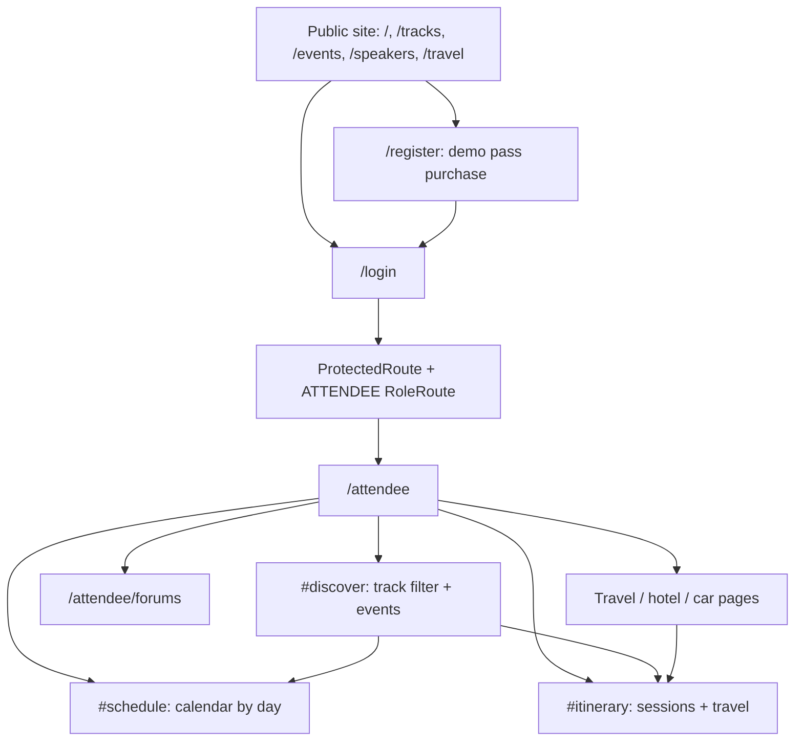

# STEAM Con attendee handoff for Jaiden

Prepared September 18, 2026. Repository: SparkCitySTEAMConvention/STEAMCon. Target branch: `frontend-attendee-screen`. Reviewed base: `7cd4ecd` (includes the team's Dev merge). This document describes the attendee dashboard and forum changes built on that base. Paths are relative to the repository root.

## Navigation map



| Browser route / destination | Page or behavior | Access |
| --- | --- | --- |
| `/` | HomePage.jsx | Public |
| `/tracks` | TracksPage.jsx | Public |
| `/events` | EventsPage.jsx; experience query selects schedule/workshops/talks/special/showcase | Public |
| `/speakers` | SpeakerDirectory.jsx | Public |
| `/travel` | TravelInfoPage.jsx: visitor guide and planning map | Public |
| `/register` | RegistrationPage.jsx: demonstration purchase | Public |
| `/registration-qr` | RegistrationQrSamples.jsx | Public |
| `/login` | LoginPage.jsx: backend or demo login | Public |
| `/attendee` | attendee/AttendeeDashboard.jsx | Signed-in ATTENDEE |
| `/attendee#schedule` | Calendar panel, day selector | Signed-in ATTENDEE |
| `/attendee#itinerary` | Combined itinerary panel | Signed-in ATTENDEE |
| `/attendee#discover` | Track selection and session enrollment preview | Signed-in ATTENDEE |
| `/attendee/forums` | attendee/AttendeeForums.jsx | Signed-in ATTENDEE |
| `/attendee/travel` | attendee/TravelBookingPage.jsx, kind=travel | Signed-in ATTENDEE |
| `/attendee/hotel` | attendee/HotelBookingPage.jsx | Signed-in ATTENDEE |
| `/attendee/car` | attendee/TravelBookingPage.jsx, kind=car | Signed-in ATTENDEE |
| Admission button | Native dialog, no new URL | On attendee dashboard |
| `/speaker` and `/speaker/forums` | Separate speaker workspace and shared forum UI | Signed-in SPEAKER |
| `/access-denied` | AccessDenied.jsx | Wrong-role destination |

## Dashboard behavior

On desktop wider than 1000 CSS pixels and taller than 650 CSS pixels, the dashboard occupies `100dvh`. Calendar, itinerary, and tracks are side by side. Long content scrolls inside keyboard-focusable panels. Header links expose travel, hotels, cars, forum and admission details. On smaller or shorter screens, panels stack and the page scrolls to preserve readable content and access when zoomed.

The calendar is a day-by-day agenda using existing Day 1 / Day 2 sample data; it does not invent confirmed dates. Adding/removing an optional session updates both the calendar and itinerary. Required events cannot be removed. Track filtering only changes discovery results, not enrollment. Admission opens in a native dialog with Escape/Close support.

## File structure and responsibilities

| Repository path | Responsibility |
| --- | --- |
| `frontend/src/App.jsx` | Browser routes, titles, ATTENDEE/SPEAKER route guards |
| `frontend/src/auth/ProtectedRoute.jsx` | Requires login |
| `frontend/src/auth/RoleRoute.jsx` | Requires matching portal role |
| `frontend/src/auth/AuthContext.jsx` | Auth session and user state |
| `frontend/src/components/attendee/AttendeeHeader.jsx` | Compact navigation, admission dialog, account controls |
| `frontend/src/pages/attendee/AttendeeDashboard.jsx` | Selected sessions, active day/track, three panels |
| `frontend/src/pages/attendee/AttendeeDashboard.css` | Viewport layout, internal scroll, responsive fallback |
| `frontend/src/components/attendee/SessionCard.jsx` | Track identity, details, add/remove button |
| `frontend/src/components/attendee/ItineraryItem.jsx` | Shared itinerary row |
| `frontend/src/pages/attendee/AttendeeForums.jsx` | ATTENDEE wrapper around shared forum page |
| `frontend/src/components/ForumPage.jsx` | Shared forum list, messages, composer, loading/error/retry |
| `frontend/src/pages/speaker/SpeakerForums.jsx` | SPEAKER wrapper; retains speaker route |
| `frontend/src/services/attendeeForumSource.js` | Attendee identity, demo isolation, READ/POST payloads |
| `frontend/src/services/forumRepository.js` | Authenticated forum HTTP requests |
| `frontend/src/services/attendeeRepository.js` | Current preview adapter; not a live dashboard API |
| `frontend/src/mocks/attendeeData.js` | Sample attendee, admission, tracks and sessions |
| `frontend/src/mocks/forumData.js` | Demo track, organizer and concierge forum directory |
| `frontend/src/utils/travelBookings.js` | Device-local booking storage and itinerary projection |
| `frontend/src/pages/attendee/TravelBookingPage.jsx` | Demo air/train and car forms |
| `frontend/src/pages/attendee/HotelBookingPage.jsx` | Demo hotel flow |
| `frontend/src/services/eventRepository.js` | Existing track/session/occurrence read adapter |
| `frontend/src/services/calendarRepository.js` | Existing GET /api/calendar/me adapter |
| `frontend/src/services/authService.js` | Login, restore, logout, authenticatedFetch |
| `frontend/src/services/registrationRepository.js` | Simulated registration submission |
| `frontend/vite.config.js` | /api proxy; default localhost:8080, configurable target |
| `frontend/tests/attendeeWorkspace.test.js` | Mounted dashboard/filter/calendar/forum navigation tests |
| `frontend/tests/attendeeForumSource.test.js` | Demo isolation, identity checks, exact READ/POST contracts |
| `backend/src/main/java/com/sparkcity/steamcon/` | Java package root for controllers below |
| `backend/.../auth/AuthController.java` | Login, register, current session, logout |
| `backend/.../events/` | TrackController, SessionController, SessionOccurrenceController, EnrollmentController |
| `backend/.../calendar/CalendarController.java` | Combined itinerary endpoint |
| `backend/.../communication/CommunicationController.java` | Forum directory and messages |
| `backend/.../booking/` | Hotel, reservation, travel-leg, car-rental controllers |
| `backend/.../config/SecurityConfig.java` | Backend authentication rules |

`backend/.../` above expands to the Java package root on the preceding row. Files such as AttendeeSummary.jsx and BookingCard.jsx remain available, but are no longer rendered by the compact dashboard.

## API endpoints: authentication and program

These are existing controller mappings, inspected from source; live integration was not exercised against a running backend. Browser routes are not API endpoints. Authenticated requests use `X-Session-Id` via `authenticatedFetch`.

| Method and endpoint | Input / output | Current attendee usage |
| --- | --- | --- |
| POST `/api/auth/login` | JSON email, password -> session response | Used for real login |
| GET `/api/auth/me` | Session header -> session and user | Restores backend login |
| POST `/api/auth/logout` | Session header -> 204 | Used for backend logout |
| POST `/api/auth/register` | JSON email, displayName, password -> UserResponse | Exists; public registration preview does not call it |
| GET `/api/tracks` or `/api/tracks/{id}` | Track list or track | Adapter exists; attendee dashboard still uses mock tracks |
| GET `/api/sessions` or `/api/sessions/{id}` | Session list or session | Adapter exists; attendee dashboard still uses mock sessions |
| GET `/api/session-occurrences` or `/api/session-occurrences/{id}` | Scheduled occurrences | Use occurrence IDs for new enrollment integration |
| POST `/api/enrollments` | JSON sessionOccurrenceId -> enrollment; user from authenticated principal | Dashboard Add is local state only |
| DELETE `/api/enrollments?attendeeId=...&sessionId=...` | UUID query values -> 204 | Dashboard Remove is local state only |
| GET `/api/calendar/me` | Authenticated principal -> sourceId, entryType, startsAt, endsAt | Existing adapter; not wired to attendee dashboard |

Important integration mismatch: POST enrollment uses `sessionOccurrenceId`, but DELETE currently takes `attendeeId` and `sessionId`. Confirm the intended cancellation contract with the backend owner before wiring removal. Calendar entries provide IDs and times rather than display titles/locations; resolve the referenced records. Replace the preview `order` sorting with actual timestamps when connecting live itinerary data.

## API endpoints: forum and booking

| Method and endpoint | Input / output | Current attendee usage |
| --- | --- | --- |
| GET `/api/forums?scope=TRACK` | scope optional; TRACK, ADMIN or CONCIERGE -> forum list | Live forum adapter when backend-authenticated |
| GET `/api/forums/{id}/messages?role=ATTENDEE&permission=READ` | Forum UUID -> messages | Live forum read |
| POST `/api/forums/{id}/messages` | JSON authorId, body, role=ATTENDEE, permission=POST -> message | Live forum post |
| GET `/api/hotels` | Hotel list | Exists; hotel page uses demo inventory |
| POST `/api/hotel-reservations` | userId, hotelId, checkIn, checkOut | Demo page saves locally; no reservation submitted |
| POST `/api/travel-legs` | userId, origin, destination, departureAt, arrivalAt | Demo page saves locally; no ticket purchased |
| POST `/api/car-rentals` | userId, pickupAt, dropoffAt, pickupLocation, dropoffLocation | Demo page saves locally; no rental submitted |

The attendee forum source uses the authenticated user's ID and the fixed ATTENDEE role; composer fields cannot override them. Backend forum policies determine access. The current server accepts role/permission/author fields from requests: server-side identity and authorization should be verified by the backend owner before production use. A listed forum is not a guarantee of READ or POST access. The UI preserves a failed post's draft and provides retry for failed loads.

## Demo vs live: handoff boundaries

- Dashboard identity, pass, tracks, sessions and schedule are preview data, including for a backend-authenticated attendee. The redesigned page does not claim backend enrollment persistence.
- Enrollment changes are component state and reset after leaving/reloading the dashboard.
- Travel bookings use localStorage key `steamcon-attendee-travel-bookings`. This is device-local demo storage, not isolated per attendee and not a real booking service.
- Demo login uses sessionStorage key `steamcon.auth`. Public demo credentials are defined in `frontend/src/auth/demoConfig.js`.
- Demo forum messages stay in memory until the forum page is left or reloaded. No live forum API calls are made in demo mode.
- Backend forum mode requires a backend-authenticated ATTENDEE with a UUID user ID and a valid backend session; service errors do not fall back to fabricated messages.
- Public demo purchase does not charge money or create a persistent account. `/api/auth/register` exists separately; role/admission assignment remains an integration concern.
- There is no `/api/attendee/dashboard` or `/api/attendee/forums` controller. Do not implement clients against those assumed endpoints.

## Validation and review

Build and lint pass. Attendee source and mounted interaction tests pass. The full frontend suite has one pre-existing failure in `trackVisual.test.js`: a hard-coded checksum for App.css no longer matches the branch. App.css was not changed in this work. Browser rendering could not be checked because the browser download was blocked; review desktop sizing and mobile layout locally.

Review at 1440x900 and 1366x768: confirm all three headings and panels fit without document scrolling, while each panel can scroll independently. At 390px width and 200% zoom, verify readable stacked panels and no clipped controls. Try every track, switch calendar days, add/remove a session, open/close admission, visit all booking links, and post a demo forum message. Backend forum permission failures and network failures should retain the draft.

Run from the repository's frontend directory:

```bash
npm install
npm test
npm run lint
npm run build
npm run dev
```

For a teammate's API work, start with attendeeRepository.js, eventRepository.js, calendarRepository.js, and the exact controller contracts above. Keep Grow Here separate: STEAM Con uses Vite on 5173 and its default API proxy is 8080; Grow Here's 8081 is not this project's backend.
